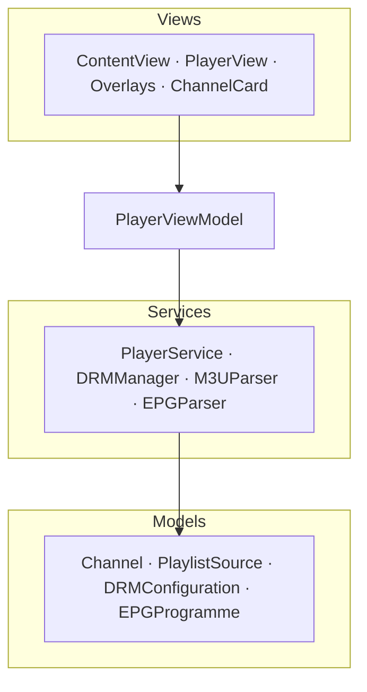

# VideoPlayer (tvOS · iPhone)

> Reproductor de streaming para **Apple TV / iPhone** hecho con **SwiftUI**: HLS,
> **FairPlay DRM** de punta a punta, listas M3U y controles de reproducción para TV.

[](https://github.com/Anticlub/VideoPlayer/actions/workflows/ci.yml)


📱 **También disponible para Android** → [VideoPlayer-KT (Android/Kotlin)](https://github.com/Anticlub/VideoPlayer-KT).
Mismo producto, dos ecosistemas nativos.

---

## Capturas

> _Pendiente de añadir (Fase B):_ barra de canales, overlay de info, quality picker y un GIF de zapping.
> Capturar con `xcrun simctl io booted recordVideo zapping.mov` y convertir a GIF con `ffmpeg`.

<!-- | Canales | Info overlay | Calidad |
|---|---|---|
|  |  |  | -->

---

## Features

- ▶️ **Reproducción HLS** con `AVPlayer`.
- 🔐 **FairPlay DRM** completo vía `AVAssetResourceLoaderDelegate` (flujo SPC → CKC).
- 📂 **Listas M3U** con parser propio (logo, grupo, nombre de canal).
- 🎚️ **Selector de calidad** manual a partir de las variantes del stream.
- 📺 **UI de TV**: barra de canales, overlays de info/selección, navegación por foco (tvOS).
- 🗓️ **EPG** (guía de programación XMLTV): parser + modelo listos ([en curso](https://github.com/Anticlub/VideoPlayer/tree/feat/add-epg) su integración en la UI).

## Paridad de features (tvOS ↔ Android)

| Feature | tvOS | Android |
|---|:---:|:---:|
| Reproducción HLS | ✅ | ✅ |
| Playlists M3U | ✅ | ✅ |
| DRM | ✅ FairPlay | 🚧 Widevine |
| EPG | 🚧 | 🚧 |
| Login | ✅ (iPhone) | ✅ Firebase |
| Backend compartido | 🚧 | ✅ |
| Tests unitarios | ✅ | 🚧 |
| CI | ✅ | ✅ |

Las casillas 🚧 son el roadmap público del proyecto multiplataforma.

## Arquitectura

MVVM con servicios inyectables por protocolo (testeables con mocks).



- **Views** — SwiftUI, navegación por foco de tvOS, overlays y controles.
- **PlayerViewModel** — estado de reproducción, playlists, canales y variantes.
- **Services** — `PlayerService` (crea el `AVPlayer`), `DRMManager` (FairPlay), parsers M3U/EPG. Inyectables por protocolo (`PlayerServiceProtocol` + `MockPlayerService` en tests).
- **Models** — tipos de dominio (canal, fuente de playlist, config DRM, programa EPG).

### Flujo FairPlay DRM

```
AVPlayer carga el manifiesto HLS → detecta la clave skd://
→ AVAssetResourceLoaderDelegate intercepta la petición
→ DRMManager genera el SPC → lo envía al license server
→ el servidor devuelve el CKC → AVPlayer descifra y reproduce
```

## Stack técnico

Swift 6 · SwiftUI · AVFoundation / AVKit · FairPlay (AVAssetResourceLoader) · Combine · async/await · XCTest.

## Puesta en marcha

```bash
git clone https://github.com/Anticlub/VideoPlayer.git
open VideoPlayer.xcodeproj
```

- Requiere **Xcode** con plataforma tvOS instalada.
- Ejecutar en el simulador de Apple TV o en iPhone.
- ⚠️ FairPlay DRM **no funciona en el simulador**; para probar DRM real hace falta un dispositivo Apple.

### Tests

```bash
xcodebuild test \
  -project VideoPlayer.xcodeproj \
  -scheme VideoPlayer \
  -destination 'platform=tvOS Simulator,name=Apple TV' \
  -testPlan VideoPlayer
```

## Licencia

[MIT](LICENSE) © 2026 Cristofer Fernandez
